# Helm Playground

---

## 1. Vagrant Ortamının Başlatılması

İlk olarak sanal makineler ayağa kaldırılır:

```bash
vagrant up 
```

Ardından K3s server node’una bağlanılır:

```bash
vagrant ssh server-0
```

---

## 2. Kubeconfig Dosyasının Ayarlanması (Remote Access)

Cluster’ı kendi bilgisayarımızdan yönetebilmek için kubeconfig dosyası yapılandırılır.

Server node üzerinde:

```bash
cat /etc/rancher/k3s/k3s.yaml
```

Komut çıktısının **tamamı kopyalanır**.

Server’dan çıkılır:

```bash
exit
```

Kendi bilgisayarımızda kubeconfig dosyası açılır:

```bash
vim ~/.kube/config
```

Kopyalanan içerik buraya yapıştırılır.

### Server IP Güncellemesi

Aşağıdaki satırda bulunan `server` adresi:

```yaml
server: https://127.0.0.1:6443
```

Vagrantfile’da tanımlanan **server node’un private static IP adresi** ile değiştirilir.  
Bu işlem, VM dışından cluster’a erişim sağlamak için gereklidir.

---

## 3. Helm Chart Seçimi

Helm chart’ları incelemek için:

- https://artifacthub.io/

Bu çalışma kapsamında **Bitnami NGINX chart’ı** tercih edilmiştir.

---

## 4. Bitnami Helm Repository Ekleme

Bitnami repository ekli değilse aşağıdaki komutlar çalıştırılır:

```bash
helm repo add bitnami https://charts.bitnami.com/bitnami
helm repo update
```

---

## 5. NGINX Helm Chart Deploy Edilmesi

NGINX, belirli bir versiyon ile deploy edilir:

```bash
helm install my-nginx bitnami/nginx --version 22.4.3
```

Özel değerler (values) kullanılmak istenirse:

```bash
helm install my-nginx bitnami/nginx \
--version 22.4.3 \
-f /localpath/values/nginx_value.yaml
```

---

## 6. Helm NOTES Bölümü Nedir?

Helm install işleminden sonra görünen **NOTES** bölümü;

- Uygulamaya erişim yöntemleri  
- Port ve servis bilgileri  
- DNS yönlendirmeleri  
- Chart’a özel uyarılar  

gibi bilgileri içerir.

Bu alan, **chart geliştiricisi tarafından** kullanıcıyı yönlendirmek amacıyla tanımlanır.

---

## 7. Helm Upgrade ile Kaynak Güncellemesi

İstenen görev:

> Uygulamanın 1 CPU ve 2 GB memory ile 3 replica çalışacak şekilde  `helm upgrade` ile güncellenmesi

Sistem kaynaklarım yeterli olmadığı için uygulama aşağıdaki değerlerle güncellenmiştir:

- **1 CPU**
- **512Mi Memory**
- **2 Replica**

### Örnek `values.yaml`

```yaml
resources:
  requests:
    cpu: "1"
    memory: "512Mi"
  limits:
    cpu: "1"
    memory: "512Mi"
replicaCount: 2
```

### Upgrade İşlemi

```bash
helm upgrade my-nginx bitnami/nginx \
--version 22.4.3 \
-f /localpath/values/nginx_value.yaml
```

---

---

## 8. Basit Hello World Uygulaması (Kontrol Amaçlı)

Aşağıdaki imaj ve komut ile çok basit bir Node.js HTTP server deploy edildi:

```yaml
image:
  repository: node
  tag: "alpine3.23"
  pullPolicy: Never

command:
  - sh
  - -c
args:
  - |
    node -e "require('http').createServer((_,res)=>res.end('hello world\n')).listen(80)"
```

Pod ayağa kalktıktan sonra port-forward ile erişim sağlandı:

```bash
kubectl port-forward hello-world-8b9bf7445-hfb64 7076:80
```
Curl ile `http://localhost:7076` adresine gidildiğinde **hello-world** çıktısı görüldü.

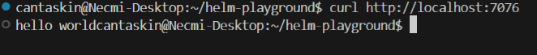


---

## 9. Hatalı Versiyon ve Rollback Senaryosu

Bilinçli olarak olmayan bir versiyon deploy edilmeye çalışıldı. Bu durumda uygulamanın çalışmadığı gözlemlendi.

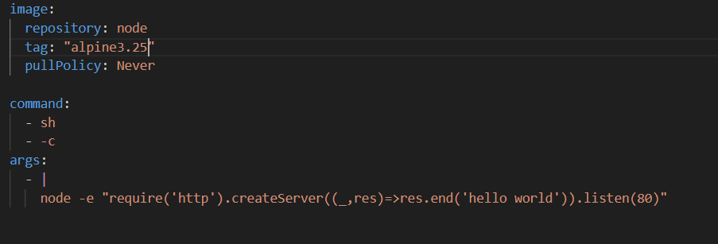

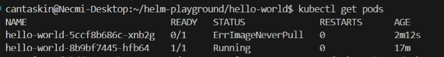

Ardından Helm rollback işlemi uygulandı ve önceki çalışan sürüme geri dönüldü. Rollback sonrası pod’ların tekrar **Running** durumuna geçtiği doğrulandı.

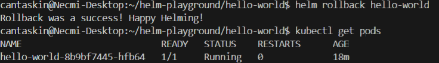

---

## 10. WordPress Helm Chart Kurulumu

Bitnami WordPress chart’ı aşağıdaki komut ile kuruldu:

```bash
helm install my-wordpress bitnami/wordpress --version 28.1.2
```

Kurulumdan sonra özelleştirme yapmak için `values.yaml` dosyası oluşturuldu.

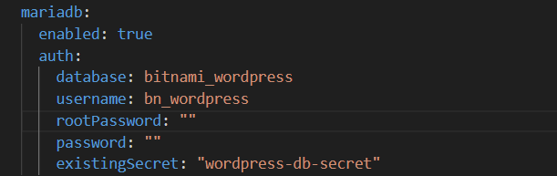

---

## 11. Secret Kullanımı (Veritabanı Şifresi)

Öncelikle WordPress’in kullanacağı veritabanı bilgileri **Secret** olarak tanımlandı:

```bash
kubectl apply -f /home/cantaskin/helm-playground/helm/values/wordpress_secret.yaml
```

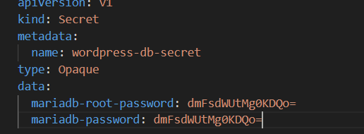

Daha sonra bu secret’ın kullanıldığı `values.yaml` dosyası ile Helm upgrade yapıldı:

```bash
helm upgrade my-wordpress bitnami/wordpress \
  -f /home/cantaskin/helm-playground/helm/values/wordpress_value.yaml
```

Pod’ların durumunu kontrol etmek için:

```bash
kubectl get pods
```

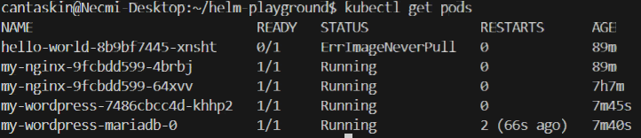


Secret’ın gerçekten pod tarafından alındığını doğrulamak için:

```bash
kubectl describe pod <wordpress-pod-name>
```


---

## 12. Ingress Sonrası Erişim Problemi ve Troubleshooting

Ingress tanımlandıktan sonra WordPress’e tarayıcıdan erişilemediği fark edildi. Bunun üzerine aşağıdaki adımlar izlendi:

* Önce NodePort üzerinden erişim test edildi.
* VM içine girilerek aşağıdaki komut çalıştırıldı:

```bash
curl http://localhost:30266
```

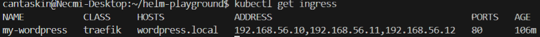

Bu komutun **cevap vermesi**, servisin VM içinde çalıştığını gösterdi.

Sorunun VM dışından gelen trafiğin engellenmesi olduğu anlaşıldı. Bu nedenle firewall kontrol edildi ve ilgili port açıldı:

```bash
sudo ufw allow 30266
```

Daha sonra host makineden tekrar denendi:

```bash
curl -H "Host: wordpress.local" http://192.168.56.10:80
```

Bu sefer başarılı şekilde cevap alındı.

---

## 13. TLS (HTTPS) Yapılandırması

Öncelikle self-signed sertifika oluşturuldu:

```bash
openssl req -x509 -nodes -days 365 \
  -newkey rsa:2048 \
  -keyout tls.key \
  -out tls.crt \
  -subj "/CN=wordpress.local"
```

Ardından Kubernetes TLS secret oluşturuldu:

```bash
kubectl create secret tls wordpress-tls-secret \
  --cert=tls.crt \
  --key=tls.key
```

Secret oluşturulduktan sonra WordPress Helm release tekrar güncellendi:

```bash
helm upgrade my-wordpress bitnami/wordpress \
  -f /home/cantaskin/helm-playground/helm/values/wordpress_value.yaml
```

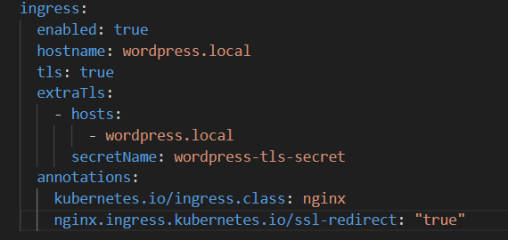
---

## 14. Windows Hosts Dosyasına DNS Kaydı Ekleme

Ingress üzerinden alan adı ile erişebilmek için Windows tarafında hosts dosyasına aşağıdaki ekleme yapıldı:

```text
192.168.56.10   wordpress.local
```

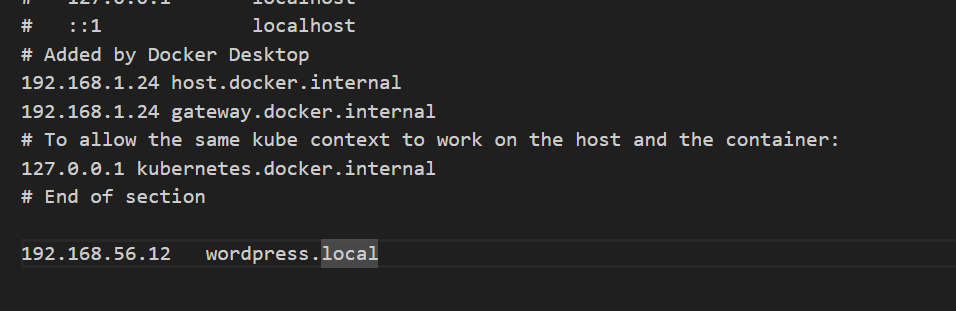

Dosya yolu:

```
C:\Windows\System32\drivers\etc\hosts
```

---

## 15. Sonuç 🎉

Tüm bu adımlardan sonra WordPress uygulamasına tarayıcı üzerinden **HTTPS** ile sorunsuz şekilde erişim sağlandı.

> TA DAAAAA! 🚀

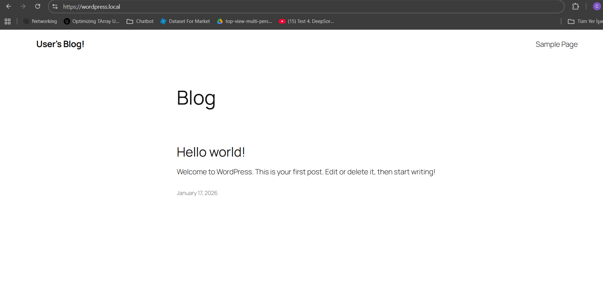

---